# Garden Contribution Grid

Gerador de **SVG animado** para usar como contribution grid do GitHub — um jardim onde cada quadrado de commit é uma terra, regada por uma garotinha com regador. Quanto mais commits no dia, mais fértil a terra e mais bonita a flor que brota.

Inspirado nos grids animados (cobrinha, etc.), mas com vibe **Bomberman**: personagem em pixel art, caminhando pela grade e regando cada plot uma vez.

## Como funciona

1. **Commits → terras** — cada célula do grid (7 dias × 53 semanas) representa um dia; a intensidade da cor indica fertilidade (0–4+ commits).
2. **Garota jardineira** — percorre todas as terras com commits, uma a uma, e rega cada uma só uma vez.
3. **Flores em 4 estágios** — após regar, brotam em estágios; o tipo de flor depende do tier de fertilidade.
4. **Final** — personagem para e espera tudo florescer, com emojis ❤️ 💻 ✨ flutuando acima.

## Demonstração

<p align="center">
  <a href="https://raw.githubusercontent.com/SebastiaoPimenta/garden/main/output/garden-contribution.svg">
    <strong>Clique para ver a animação em tela cheia</strong>
  </a>
</p>

<p align="center">
  <a href="https://raw.githubusercontent.com/SebastiaoPimenta/garden/main/output/garden-contribution.svg">
    
  </a>
</p>

<p align="center"><sub>Prévia no README — use o link acima para ver maior e com animação completa no navegador.</sub></p>

## Início rápido

```bash
# Gera dois arquivos em output/:
#   garden-contribution.svg       → GitHub (sprites por URL relativa)
#   garden-contribution.local.svg → abrir no navegador (sprites embutidas)
python3 -m src.main

# Um único SVG embutido (caminho customizado)
python3 -m src.main -o output/meu-jardim.svg

# A partir de JSON (útil para testar)
python3 -m src.main -j examples/sample-contributions.json

# Verificar sprites faltando
python3 -m src.main --check-sprites
```

## Sprites (PNG)

Coloque seus sprites em `sprites/`. Convenção completa em [`sprites/README.md`](sprites/README.md).

```
sprites/
├── character/
│   ├── front/   back/   left/   right/
│   │   └── idle/   walk/   watering/   → 000.png, 001.png …
│   └── waiting/                         → poses pós-rega
├── flowers/
│   └── tier-1 … tier-4/
│       └── stage-1.png … stage-4.png
├── soil/          (opcional)
└── effects/       (opcional)
```

**Personagem:** 48×65 px (pés embaixo), 4 views × 3 ações (+ múltiplos frames em `walk/`).

**Flores:** 4 tiers (beleza) × 4 estágios (crescimento).

Sem sprites, o gerador usa **placeholders** coloridos para você visualizar a animação enquanto desenha os PNGs.

## Uso no GitHub

1. Gere os SVGs: `python3 -m src.main`
2. Faça commit de `output/garden-contribution.svg` (e a pasta `sprites/`)
3. Para pré-visualizar localmente, abra `output/garden-contribution.local.svg` no navegador
4. O README já inclui a prévia com link para tela cheia (HTML abaixo). Para usar em outro repo, ajuste a URL raw:

```html
<p align="center">
  <a href="https://raw.githubusercontent.com/SEU_USUARIO/garden/main/output/garden-contribution.svg">
    <strong>Ver animação em tela cheia</strong>
  </a>
</p>
<p align="center">
  <a href="https://raw.githubusercontent.com/SEU_USUARIO/garden/main/output/garden-contribution.svg">
    
  </a>
</p>
```

> `width="1200"` deixa a prévia maior no README (pode rolar na horizontal). O link **raw** abre o SVG animado no Chrome/Firefox em tamanho real.

## Estrutura do projeto

```
garden/
├── sprites/          # seus PNGs aqui
├── src/
│   ├── config.py     # grid, cores, timing
│   ├── git_contributions.py
│   ├── garden.py
│   ├── pathfinding.py
│   ├── animator.py
│   ├── svg_builder.py
│   └── main.py
├── examples/
│   └── sample-contributions.json
└── output/           # SVG gerado
```

## Personalização

Edite `src/config.py` para ajustar:

- `CELL_SIZE` / `CELL_GAP` — tamanho das células
- `SOIL_COLORS` — cores fallback das terras
- `TIMING` — velocidade de caminhada, rega, crescimento e emojis

## Licença

MIT — use e adapte como quiser.
